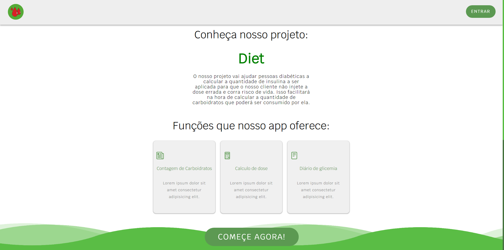
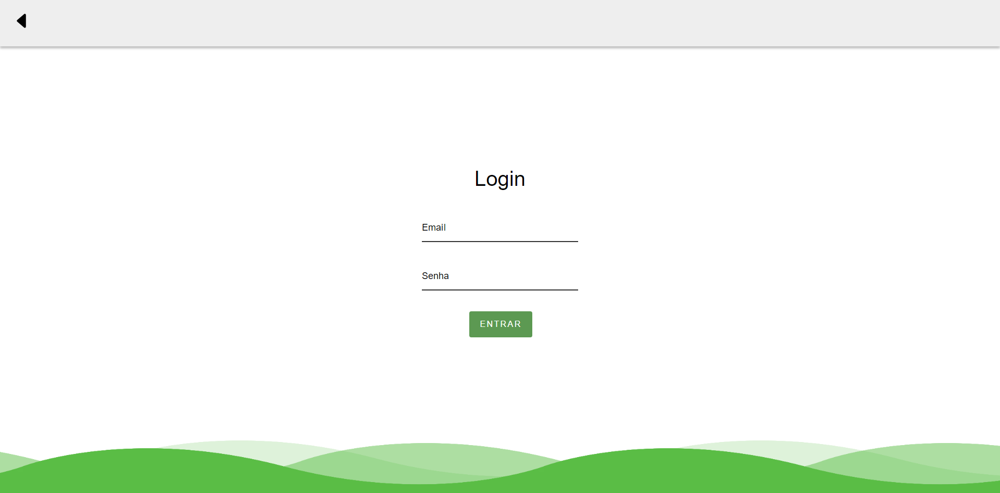
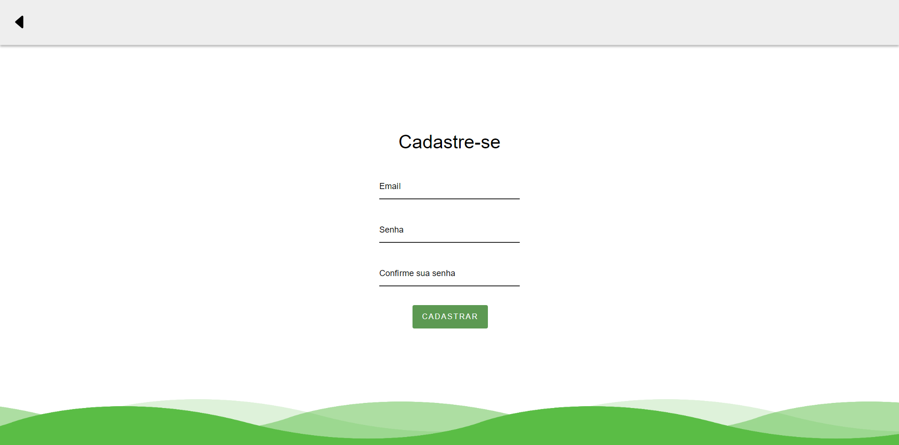

  

<h1 align="center">Diet </h1>

A ideia do nosso site é divulgar o nosso app que tem o propósito de ajudar as pessoas que possuem diabetes com algumas funções.

## Funções 

- Contagem de carboidratos
- Calculo de dose
- Diário de glicemia
- Notícias e dicas sobre a diabete

## Fotos do site

## Membros deste projeto

- João Gabriel 
- Gabriel Althoff
- Davi Queiroz
- Willian Feng 
- Oliver Kanai
